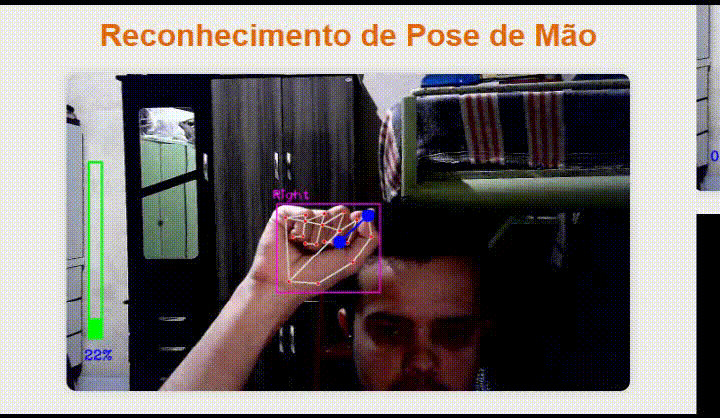

# Reconhecimento de pose de mão

Este é um projeto de visão computacional para reconhecer a mão e aumentar o tamanho de uma barra com o movimento do dedo Indicador e Polegar.



## Como Executar o Projeto

Siga os passos abaixo para configurar e executar o projeto no seu ambiente local.

### Clonar o Repositório

Para começar, clone o repositório para o seu computador:

```bash
git clone https://github.com/ben-hurs/reconhecimento-de-pose-de-mao.git
```

### Navegue até a pasta do repositório
```bash
cd reconhecimento-de-pose-de-mao
```

### Criar e ativar um Ambiente virtual
#### Windows:
```bash
# Instalar a ferramenta venv
python -m pip install virtualenv

# Criar um ambiente virtual
python -m venv env

# Ativar o ambiente virtual
.\env\Scripts\activate
```

#### Linux/Mac:
```bash
# Criar um ambiente virtual
python3 -m venv env

# Ativar o ambiente virtual
source env/bin/activate

```

### Instalação dos pacotes
Com o ambiente virtual ativado, instale os pacotes. (esta etapa pode demorar alguns minutos)
```bash
pip install -r requeriments.txt
```

### Executar o arquivo
```bash
python main.py
```

### Copie a porta no seu navegador
```bash
http://192.168.1.71:5000
```


